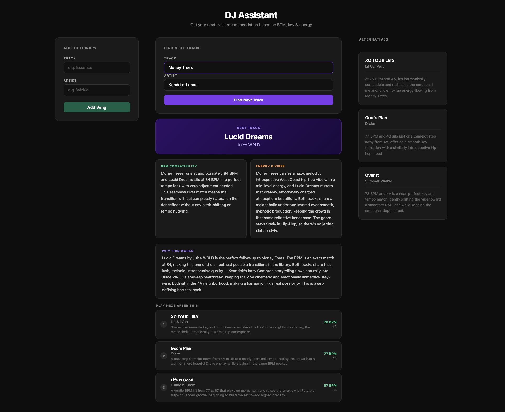

# DJ Assistant

An AI-powered DJ assistant that recommends the best next track to play in your set. Enter the track you're currently playing and it looks the song up on MusicBrainz, then asks Claude to pick the ideal follow-up from your library based on **BPM**, **harmonic key compatibility** (Camelot Wheel), and **energy flow**.

It also gives you three alternative picks, a suggested chain of the next three tracks to keep the set going, and lets you grow your library by adding your own songs — Claude fills in the BPM, key, energy, and genre automatically.

## Screenshot



## Tech Stack

- **Python** — core language
- **Flask** — web framework serving the UI and routes
- **MusicBrainz API** — looks up track metadata and powers the "Did you mean?" suggestions
- **Anthropic Claude API** — `claude-sonnet-4-6` makes the recommendations and estimates BPM/key for newly added tracks

## Running Locally

### 1. Install dependencies

```bash
pip install -r requirements.txt
```

### 2. Set up your environment

Create a `.env` file in the project root with your Anthropic API key and a secret key for Flask sessions:

```
ANTHROPIC_API_KEY=sk-ant-...
SECRET_KEY=your-random-secret-here
```

You can generate a secure `SECRET_KEY` with:

```bash
python3 -c "import secrets; print(secrets.token_hex(32))"
```

> Get your Anthropic API key from [console.anthropic.com](https://console.anthropic.com). The `.env` file is gitignored so your keys stay out of version control.

### 3. Run the app

```bash
python3 app.py
```

Then open [http://127.0.0.1:5000](http://127.0.0.1:5000) in your browser.

## Customising Your Library

The DJ library lives in `library.json` — a simple list of tracks, each with a title, artist, BPM, Camelot key, genre, and energy rating:

```json
{
  "title": "Kill Bill",
  "artist": "SZA",
  "bpm": 89,
  "key": "8A",
  "genre": "R&B",
  "energy": 5
}
```

You can edit this file directly to add, remove, or tweak tracks, or use the **Add to Library** form in the app to look a song up and add it automatically. Build it out with your own collection to get recommendations tailored to what you actually play.
